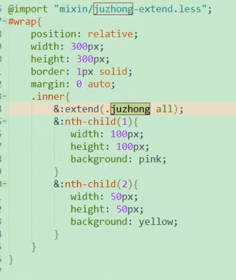
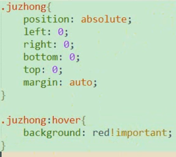

## 介绍
- less 依赖于JavaScript
- 安装less和less-loader
- 可以用考拉编译

## 注释：
- //编译前可见
- /**/编译前后都可见

## 用法：
1. 嵌套：
```css
//父子关系：
.container{
    .inner{
    }
}
//平级关系（伪类），用&：
.container{
    .inner{
        &:hover{
        }
    }
}

```
2. 变量：$定义
- **变量是延迟加载的（以最后一个变量的赋值为准）**
```css
//选择器变量：
@selector:.container; //定义
@{selector}{  //使用
    border:...
}

//属性变量：
@m:margin;  //定义
@{selector}{  //使用
    @{m}:0 auto
}

//特殊变量：
$side:top;

border-#{$side} //border-top

//颜色变量
@dark_blue: @blue - #333;  //定义
background:@dark_blue;  //使用

@border-gray:1px solid #ccc;
border:@border-gray;

@center:0 auto;

//最外层：
@at-root{
    @keyframes: ...
}
```

3. if else

4. 遍历：
让数组都拼一下icon
```css
@each $animal in 1,2,3,4 {
    .icon-#{$anmial}{
        background-image:url('/images/icon-#{$animal}.png')
    }
}

@each $header, $size in (h1:2em , h2:1.5em , h3:1.2em){
    #{$header}{
        font-size:$size
    }
}
```


3. mixIn:

- px转rem:
```css
@mixin px2rem($px){
    $px/100+rem
}
```

- 类似函数
- less可以集成为库，通过@import引入业务css
```css
.mixin(@w,@h,@c:pink){   //定义带参数并且带默认值的混合
    width:@w;
    height:@h;
    background-color:@c
}

.container{   //使用
    .inner{
        .mixin(200px,100px,gray)
    }
    .inner2{
        .mixin(@c:black) //命名参数
    }
}
```

```css
//匹配模式：
.mixin(L,@w,@c){  //朝向
    
}
.container{
    .mixin(L,40px,red)      // 使用，相同的部分收集成另一个mixin
}

//@_表示每次调用triangle混合自动执行
.triangle(@_,@w,@c){  //相同的内容
    width:0px;
    height:0px;
    overflow:hidden
}
.triangle(L,@w,@c){
    ...不相同的内容
}
```

```css
//@arguments 实参列表
.border(@1,@2,@3){
    border:@arguments;
}
.container{
    border(1px,solid,red)
}
```


```css
//混合继承：
//让inner元素所有指定子元素都获得某些样式属性：
#wrap{
    .inner{
        &:@extend(.juzhong all)  //居中放公共代码，写all可以继承所有比如hover
    }
}
```
  

4. cess计算：
- 一个数值带单位即可
- 交给浏览器去编译：
`paddnig:~"cacl(100px+100)"`


6. 占位符%：
如果用到就用用不到就不编译
