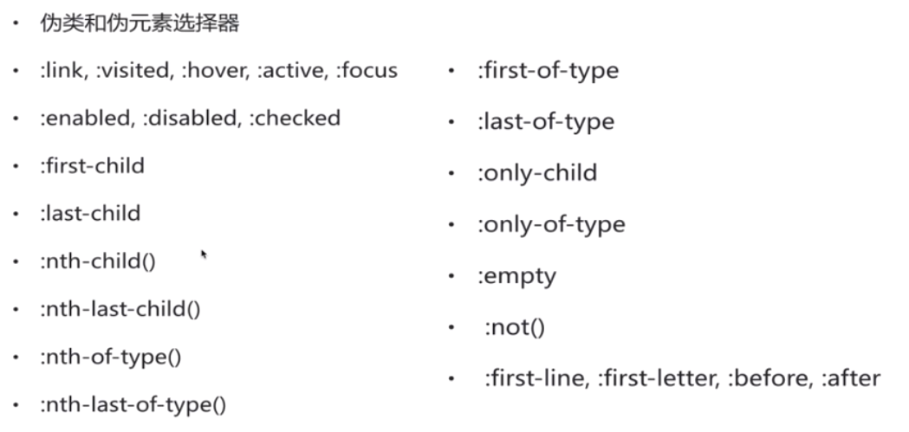

### 媒体查询
- 必备知识：
    - 逻辑操作符：not and only or(,)
    `@media not(all and(monochrome)){ ... }`  
    `@media (not (screen and (color))) , print and (color)`  
    `media="only screen and (min-width:401px) and (max-width:600px)`

    - css3 媒体属性：
    添加min-  max-前缀  
    width:viewport宽度  
    height:   
    aspect-ratio：基于视口宽度和高度的宽高比   
    device-width:  
    device-height:  
    orientation:设备横向还是纵向  
    device-aspect-ratio：设备宽高比  
    color:每种颜色位数  
    resolution：dpi 

    - viewport视口：
    放大镜：可视视口（屏幕），书：布局视口（整个网页）
    **理想视口：布局视口就是默认值，如果设置viewport则布局视口宽度和设备可视视口宽度一致（响应式必须设  置）**
    `<meta name="viewport" content="width=device-width"/>`
    *还可搭配设置缩放比例*


    - 移动端问题：  
        - 1px边框：retina屏幕分辨率始终是一般设备两倍，1px会变胖-flexible.js[2x 3x 1px](https://blog.csdn.net/wandoumm/article/details/80167197)  
        - 0.3s延迟 
            使用fastclick库
            - 引入`<script type='application/javascript' src='/path/to/fastclick.js'></script>`
            - 初始化
                ```javascript
                if ('addEventListener' in document) {
	                document.addEventListener   ('DOMContentLoaded', function() {
		            FastClick.attach(document.body);
	                }, false);
                }
                //如果浏览器不支持promise，去下载一个
                
                if(!window.Promise){
                    document.writeln('<script src="https://as.alipayobjects.com/g/component/es6-promise/3.2.2/es6-promise.min.js"></script>')
                }
                ```
        - 2x 3x 图    
        - 经典css sticky footer布局
        - 弹性布局
    
    - 项目结构：
    文件夹名单数，简写  
    @/favicon.ico网页logo  
    @/robots.txt  
    css/main.css通用样式文件  
    css/normalize.css  
    js/vendor 存放第三方库或者框架  

    - html必备基础标签设置：
    ```html
    <head>
        <mate charset="utf8">
        <mate http-equiv="x-ua-compatible" content="ie=edge"> <!--用最新模式渲染-->
        <title>理财网站</title>
        <mate name="viewport" content="width=device-width,initial-scale=1,maximum-scale=1,minimum-scale=1,user-scalable=no">
    </head>
    ```
    - ie8及以下设置：
    ```html
    <!--[if lte IE8]>
    <p>您的浏览器版本太老啦，请去 <a href="browsehappy.com">这里</a>更新</p>
    <![endif]-->
    ```
    - **动态宽度：**
        `width:calc(33.3333333%-3rem)` **1rem=rpx rem是相对值 亦可以用em**
    - **规定元素最大最小宽度：max-width** 

    - 媒体查询：
    ```
    @media only screen and (min-width:960px) {

    }
    @media only screen and (min-width:641px) and (max-width:960px){

    }
    @media only screen and (max-width:640px) {

    }
    ```
    - 如果隐藏内容直接用display:none


### css基础内容：
 - 一些样式注意：
    - 可用autoprefixer css online自动添加浮动
    - 先给整体页面分块
    - class="icon icon-zfywxkz" icon设置图片大小和展示样式 icon-zfwksd图片位置和背景
    - **.icon统一获取图标文件，.icon-zfywxkz用 background-position 调整**
    - 有滚动特效的图片要包裹在item里
    - 单位用i标签，强调用em，价格用span 
    - **除第一个以外的其他所有li：ul li+li**
    - a标签可以设置inlin-block以修改padding
    - li中间缝隙是因换行导致，解决方案：ul{ font-size:0 }
    - content可以用`/00a0`增加空格
    - 不管多长都不换行：
        ```css
        a:first-child{
            text-overflow:ellipsis;
            overflow:hidden;
            white-space:nowrap;
        }
        ```


- 初始化样式：
    css/main.css包括：
    - html样式的自定义和::selection样式的设置等等
    - 工具样式：text-center center-block
    - 清除浮动
    - 给浏览器升级提示设置样式
    - 自定义页面样式
    ```css
    /*工具样式*/
    .center-block{  //居中 
        display:block;
        margin-right:auto;
        margin-left:auto
    }
    .pull-right{
        float:right !important;
    }
    .pull-left{
        float:left !important;
    }
    .text-right{
        text-align:right !important;
    }
    .text-left{
        text-align:left !important;
    }
    .text-center{
        text-align:center !important;
    }
    .show{
        display:block !important;
    }
    .hide{
        display:none !important;
    }
    .invisible{
        visiblity:hidden
    }

    /*清除浮动*/
    .text-hide{      //为seo隐藏文本 
        font:0/0 a;
        color:transparent;
        text-shadow:none;
        background-color:transparent;
        border:0;
    }

    .clear-fix:before,
    .clear-fix:after{
        content:" ";
        display:table;  //创建匿名表格单元，可触发bfc
    }
    .clear-fix:after{
        clear:both
    }

        /*自定义页面样式*/
    body{
        font-size:1.2rem;
        line-height:1.5;
        background-color:#f7f7f7;
    }
    a{
        color:#666;
        text-decoration:none;
    }
    a:hover,a:active{
        color:#0ae;
        text-decoration:underline
    }
    ```


- 触发bfc可以清除浮动:
    * 滚动条
    * overflow
    * display：tabel-cell
    * display：tabel-caption
    * display：inline-block
    * position:fixed
    * position:absolute

- 选择器：
    - E > F 
    - ul li + li:除了第一个以外其他相邻的li
    ```html
    <ul>
        <li></li>
        <li></li>  //包括
        <li></li>  //包括
        <a></a>  //不包括
        <li></li>  //不包括
        <li></li>  //不包括
    </ul>
    ```
    - ul li ~ li:除了第一个以外其他全部li
    ```html
    <ul>
        <li></li>
        <li></li>  //包括
        <li></li>  //包括
        <a></a>  //不包括
        <li></li>  //包括
        <li></li>  //包括
    </ul>
    ```
    - E[attr*="value"] 

- 伪类选择器：

    

    - .nth p:first-child nth盒子内的第一个子元素，如果不是`<p>`不显示

    - .nth p:nth-child(2)：  
        - 先数子元素
        - 所有子元素里排第二的，如果是p显示，不是p不显示
        - 从1开始
        - nth-child(2n)代表偶数
    
    - .nth p:nth-of-type(2):
        - 先数所有p标签
        - 从p标签里数第二个

    - .nth p:only-child 只有一个子元素的nth
    - .nth p:only-type-of 只有一个子元素为p的nth

    - .nth not(p) 除了p以外的元素
