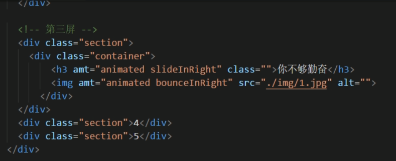
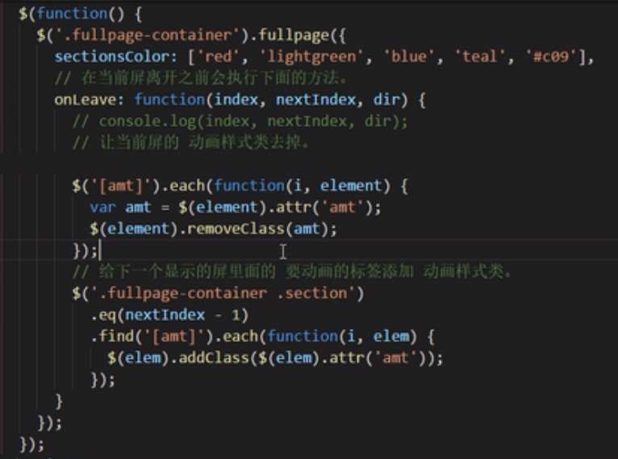

## 整体页面:
### jQuery - fullpage.js 
- 参考页面：https://www.jianshu.com/p/17309f770242
- 用途：整页滚动
- 注意点：
    - 如果每次切换都显示一次动画，需要设置onleave
        
        

## 动画：
### AnimateCSS.css
- 用法：
    - class= "animated animated-name"
